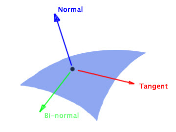
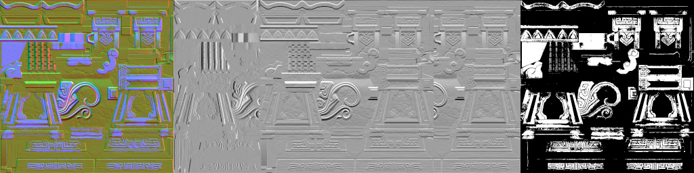
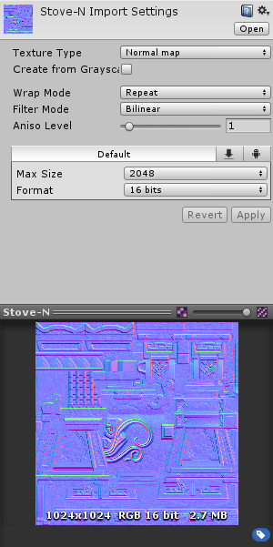
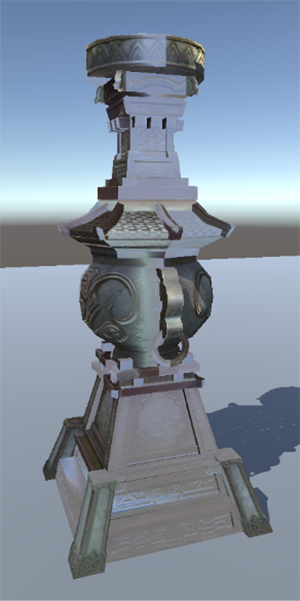
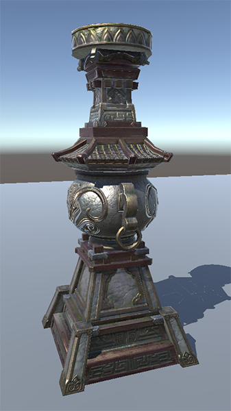
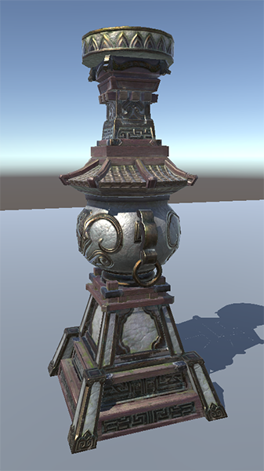
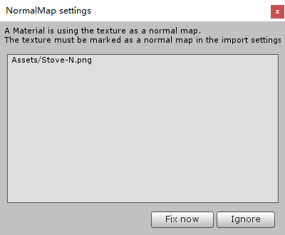

# 在Unity中利用法线贴图的B通道存储额外数据

# 一点基础知识



* 常用的法线贴图都是[Tangent Space](https://www.zhihu.com/question/23706933/answer/25591714)的，RGB通道分别记录法线在三角形的Tangent、Binormal、Normal方向上的分量，当该像素处的法线不需要偏移时，记成(0,0,1)，也就是指向三角形原本的Normal方向。这也就解释了为什么法线贴图看起来都是蓝色的

* 法线一定是单位向量，所以在TBN每个轴上的取值范围都是[-1,1]，而像素能够存储的范围是[0,1]，所以把法线向量写入法线贴图需要进行Pack，读出时再Unpack。这就是unity中写shader时取出法线贴图的像素还需要调用UnpackNormal函数的原因

# 问题来了

既然法线贴图可以用RG通道表示法线在Tangent、Binormal方向的偏移，那把B通道设为1，也可以表示最大45度角的法线扰动，一般都够用了，这是不是能**省出来B通道表示其他信息**呢，比如可以表示PBR光照中的Metallic值，从而减少一张Metallic贴图的使用。

下图显示了一张法线贴图及其单独的R、G、B通道，B通道标出了物件的金属部分，整图偏黄色。



但把这张贴图导入Unity后会发现：

* 如果Texture Type选择Normal Map，黄色不见了，贴图变回成蓝色的样子
* 如果Texture Type选择Texture，渲染的效果是错误的，哪怕用没有修改的蓝色的法线贴图都是错的

 

解决上面的问题，就可以实现用B通道存储额外信息的目标

# 解决方案

查看UnpackNormal的代码可以发现，问题就出在Unpack上，直接上结论：

* Unity导入纹理时如果选择了Normal Map，在PC平台上(包括编辑器)会对纹理进行一个叫swizzling的操作，这个操作会把R通道移到A通道，再丢弃掉B通道的信息，所以黄色不见了。这样做是为了使用[DXT5nm](http://tech-artists.org/wiki/Normal_map_compression#DXT5nm)压缩法线贴图
* Shader中UnpackNormal时会做一个相反的操作，所以，当导入贴图时选择了Texture，贴图并没有进行swizzling，这时UnpackNormal再做一次逆操作，法线数据就错误了
* 解答了这两个问题解决方案也就有了：**纹理导入时选择Texture，在Shader中自己对法线数据Unpack，简单的乘2减1即可**

一个示例Shader：

```
void surf(Input IN, inout SurfaceOutputStandard o) {
	fixed4 c = tex2D(_MainTex, IN.uv_MainTex);
	fixed4 n = tex2D(_BumpMap, IN.uv_BumpMap);
	o.Albedo = c.rgb;
	o.Normal = normalize(fixed3(n.xy * 2.0 - 1.0, 1.0));
	o.Metallic = n.z;
	o.Smoothness = _Glossiness;
	o.Alpha = c.a;
}
```

运行效果，左图是Unity的Standard，右图是使用法线图的B通道作为Metallic数据，可以看出木头和金属的区分更明显

 

# 一个小问题

纹理被Shader中的_BumpMap属性引用时，Unity会认为这张纹理是法线贴图，如果导入设置不是使用的Normal Map就会收到一个修复警告。解决方法是无视掉这个警告或者在Shader中换一个属性名，但是注意，换属性名的话，Fallback到Unity的自带Shader时纹理就不能对应起来了。

