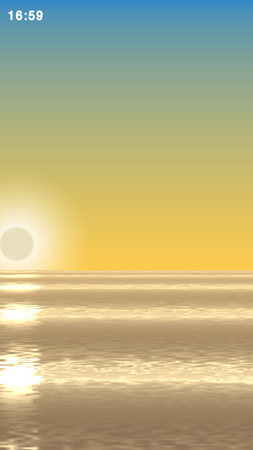
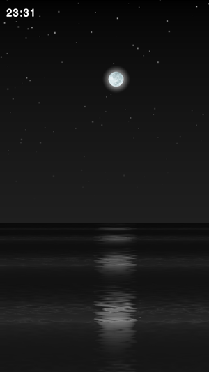

# Ejoy2d Dawn

Ejoy2d Dawn is a tech demo showing the ability of creating custom graphic effects in ejoy2d game engine.

Features:

* Seamless day-night-cycle
* 2D ocean simulation
* screen rotation support
* 1.1MB only

Control:

* Slide left and right to control time of day

## Screenshot

  

## Download

## Source

* Dawn: https://github.com/skykapok/dawn
* Ejoy2d: https://github.com/ejoy/Ejoy2d