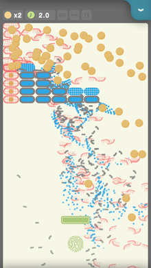
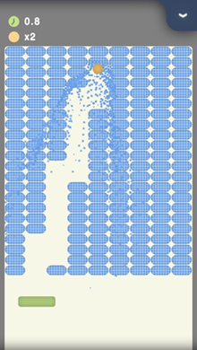
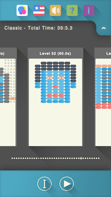

# 爆裂方块(Max Crush)

Max Crush的原型是十多年前流行的一个PC游戏**"Block130"**，是经典打砖块游戏的现代版，是IOS平台最好玩的打砖块游戏（如果不是，请告诉我）。

如果你发现了bug或者有什么建议，请在下方评论区留言。
If you find a bug or have any advices, please write down below.

## Screenshot

  

## Download

Coming Aug 2015

## Notice

* 游戏使用物理模拟，小球的运动轨迹是曲线！
* Gravity applies!
* 可以发射多个小球！
* Multiple balls may be launched at the same time.
* 点击屏幕上方发射小球，拖动挡板来避免小球掉落
* Tap the blank field area to launch the ball. Drag the paddle to prevent the balls from dropping
* 反弹小球时，左右滑动挡板会影响反弹角度，上下滑动可以让小球加减速
* Horizontal drag decides the bouncing angles; vertical drag decides the bouncing speed

## Open Source Libs Used In Max Crush:

* Ejoy2d: https://github.com/ejoy/ejoy2d
* Liekkas: https://github.com/lvzixun/Liekkas