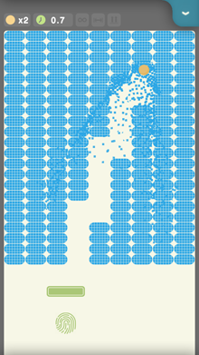

# Max Crush - 爆裂方块

*Max Crush* is a addictive fast-paced brick breaking (aka, brick breaker, breakout clone) game. May be the best one on iOS/Android platform!

《爆裂方块》是一个上手简单又令人上瘾的经典打砖块小游戏，可能是iOS/Android平台上最好玩的打砖块游戏！

## SCREENSHOTS

  

## DOWNLOADS

### iOS

如果你是在iOS版微信中打开的这个网页，需要点击右上角的按钮选择"在Safari中打开"，才可以使用上面的下载链接。

### Android

 

中国大陆各大应用商店搜索**爆裂方块**

## FEATURES

* Classic genre with realtime physics(gravity, paddle friction)
* Multiple balls may be shot simultaneously
* Superb brick smash effects
* Well-designed levels
* Endless mode
* GameCenter/GooglePlayGame support

---

* 发射小球的方向可以控制，小球会朝着手指点击的位置发射
* 通过“搓球”来控制反弹方向与速度，而不是通过挡板位置，熟练后可控性很高
* 不用等上一个小球掉落就可以发射下一个小球，发射多个小球来加快过关速度
* 小球是受重力影响的
* 非常有趣、快节奏的关卡
* 华丽的砖块粉碎效果
* 无尽模式
* 成就与排行榜

## THANKS

Open source libs used in Max Crush: 
爆裂方块中使用的开源库：

* Ejoy2d: https://github.com/ejoy/ejoy2d
* Liekkas: https://github.com/lvzixun/Liekkas

---

爆裂方块的原型是十多年前流行的一个PC游戏《Block130》。

---

If you find a bug or have any advices, please write down below. 
如果你发现了bug或者有什么建议，请在下方评论区留言。